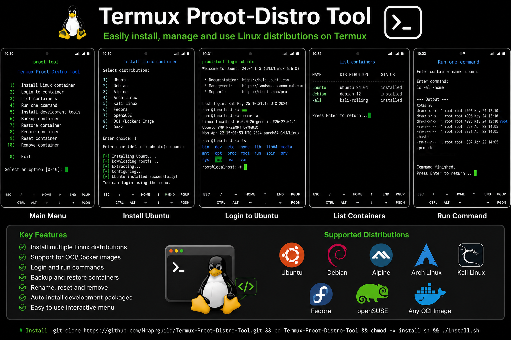

<div align="center">


<a href="https://github.com/Mraprguild/Termux-Proot-Distro-Tool">
  
</a>

<br />

[](https://github.com/Mraprguild/Termux-Proot-Distro-Tool/releases)
[](https://termux.dev/)
[](https://www.gnu.org/software/bash/)
[](LICENSE)

[](https://github.com/Mraprguild/Termux-Proot-Distro-Tool/stargazers)
[](https://github.com/Mraprguild/Termux-Proot-Distro-Tool/forks)
[](https://github.com/Mraprguild/Termux-Proot-Distro-Tool/issues)

### A colourful, menu-driven, rootless Linux container manager for Termux

[Installation](#-installation) • [Features](#-features) • [Commands](#-commands) • [Themes](#-colour-themes) • [Troubleshooting](#-troubleshooting)

</div>

---

## 🌈 Project Preview

<div align="center">
  
</div>

> [!TIP]
> Use the official Termux build from F-Droid or the Termux GitHub releases for the best package compatibility.

---

## 🚀 Overview

**Termux Proot-Distro Tool** is a GitHub-ready Bash project created by **Mraprguild**. It provides a polished interactive dashboard for installing and managing Linux containers in Termux without requiring Android root access.

The tool wraps `proot-distro` commands in an easy interface while preserving direct command-line access for advanced users and automation scripts.

<table>
<tr>
<td width="50%" valign="top">

### ⚡ Easy to use

- Interactive numbered menu
- Clear prompts and confirmations
- Colour-coded status messages
- Mobile-friendly terminal layout

</td>
<td width="50%" valign="top">

### 🛡️ Safe management

- Protected reset operations
- Protected container removal
- Backup and restore support
- Input validation and error handling

</td>
</tr>
</table>

---

## ✨ Features

| Feature | Description |
|---|---|
| 🐧 Linux installation | Install supported distributions and OCI-style images |
| 🚪 Container login | Open an interactive Linux shell instantly |
| ⚙️ Command execution | Run one command without opening a full shell |
| 🧰 Development setup | Install Git, Python, compilers, editors and common tools |
| 📦 Container list | View installed distributions and local container names |
| 💾 Backup | Create portable compressed container archives |
| ♻️ Restore | Recover a container from a backup archive |
| ✏️ Rename | Change a local container name safely |
| 🔄 Reset | Reinstall a container after confirmation |
| 🗑️ Remove | Permanently delete unwanted containers |
| 🎨 Themes | Choose Neon, Ocean, Purple or Classic terminal colours |
| 🔓 Rootless | Works without rooting the Android device |

---

## 🐧 Supported distributions

<div align="center">


</div>

Availability depends on the installed `proot-distro` release, image registry and Android CPU architecture.

---

## 📋 Requirements

- Android device with Termux
- Active internet connection
- At least 2–5 GB of free storage, depending on the distribution
- Termux package repositories configured correctly
- Android root access is **not** required

> [!WARNING]
> Do not run the installer from inside another PRoot container. Run it directly in the main Termux shell.

---

## 📥 Installation

### Method 1 — GitHub installation

```bash
pkg update -y
pkg install git -y
git clone https://github.com/Mraprguild/Termux-Proot-Distro-Tool.git
cd Termux-Proot-Distro-Tool
chmod +x install.sh
./install.sh
```

Reload the shell:

```bash
source ~/.bashrc
```

Launch the tool:

```bash
proot-tool
```

### Method 2 — One-line installation

```bash
pkg update -y && pkg install git -y && git clone https://github.com/Mraprguild/Termux-Proot-Distro-Tool.git && cd Termux-Proot-Distro-Tool && chmod +x install.sh && ./install.sh
```

### Method 3 — Install from ZIP

```bash
pkg install unzip -y
unzip Termux-Proot-Distro-Tool.zip
cd Termux-Proot-Distro-Tool
chmod +x install.sh
./install.sh
source ~/.bashrc
proot-tool
```

---

## 🖥️ Interactive dashboard

```text
╔══════════════════════════════════════════════════════╗
║                    MRAPRGUILD                        ║
║             TERMUX PROOT-DISTRO TOOL                 ║
╚══════════════════════════════════════════════════════╝
◆ Rootless Linux Manager  •  v1.1.0

CONTAINER MANAGEMENT

[ 1]  ⬇  Install Linux container
[ 2]  ➜  Login to container
[ 3]  ▦  List installed containers
[ 4]  ⌘  Run one command
[ 5]  ⚙  Install development tools

DATA & MAINTENANCE

[ 6]  ◉  Backup container
[ 7]  ↻  Restore container
[ 8]  ✎  Rename container
[ 9]  △  Reset container
[10]  ✖  Remove container

[ 0]  ◀  Exit
```

---

## ⌨️ Commands

### Open the menu

```bash
proot-tool
```

### Install Ubuntu

```bash
proot-tool install ubuntu:24.04 ubuntu
```

### Log in

```bash
proot-tool login ubuntu
```

### List installed containers

```bash
proot-tool list
```

### Run one command

```bash
proot-tool run ubuntu uname -a
```

### Create a backup

```bash
proot-tool backup ubuntu ~/ubuntu-backup.tar.xz
```

### Restore a backup

```bash
proot-tool restore ~/ubuntu-backup.tar.xz
```

### Remove a container

```bash
proot-tool remove ubuntu
```

### Show help and version

```bash
proot-tool help
proot-tool version
```

More examples are available in [`docs/COMMANDS.md`](docs/COMMANDS.md).

---

## 🎨 Colour themes

Edit the configuration file:

```bash
nano ~/.config/proot-tool/default.conf
```

Select a theme:

```bash
THEME="neon"
```

| Theme | Visual style |
|---|---|
| `neon` | Green and cyan cyber-terminal style |
| `ocean` | Blue and cyan modern interface |
| `purple` | Purple and magenta premium design |
| `classic` | Traditional terminal colour palette |

Configuration example:

```bash
DEFAULT_IMAGE="ubuntu:24.04"
DEFAULT_NAME="ubuntu"
BACKUP_DIR="$HOME/storage/downloads/proot-backups"
THEME="neon"
```

---

## 🧰 Automatic development packages

The development setup option automatically detects the Linux package manager.

<details>
<summary><b>Ubuntu and Debian packages</b></summary>

```text
git curl wget nano vim python3 python3-pip build-essential
```

</details>

<details>
<summary><b>Alpine Linux packages</b></summary>

```text
git curl wget nano vim python3 py3-pip build-base
```

</details>

<details>
<summary><b>Arch Linux packages</b></summary>

```text
git curl wget nano vim python python-pip base-devel
```

</details>

---

## 💾 Backup storage

Enable shared Android storage:

```bash
termux-setup-storage
```

The default backup directory is:

```text
~/storage/downloads/proot-backups
```

> [!CAUTION]
> Reset and remove operations can permanently destroy container data. Create a backup before using them.

---

## 📂 Project structure

```text
Termux-Proot-Distro-Tool/
├── .github/
│   ├── ISSUE_TEMPLATE/
│   │   ├── bug_report.md
│   │   └── feature_request.md
│   └── workflows/
│       └── shellcheck.yml
├── assets/
│   └── screenshot.png
├── bin/
│   └── proot-tool
├── config/
│   └── default.conf
├── docs/
│   └── COMMANDS.md
├── .gitignore
├── CONTRIBUTING.md
├── install.sh
├── LICENSE
├── README.md
├── SECURITY.md
└── uninstall.sh
```

---

## 🔧 Troubleshooting

<details>
<summary><b>proot-distro: command not found</b></summary>

```bash
pkg update -y
pkg install proot-distro -y
```

</details>

<details>
<summary><b>Shared storage directory is missing</b></summary>

```bash
termux-setup-storage
```

Grant the requested Android storage permission.

</details>

<details>
<summary><b>Container installation failed</b></summary>

```bash
pkg update -y
pkg upgrade -y
proot-distro list
```

Check the internet connection and available storage before retrying.

</details>

<details>
<summary><b>Android closes the Termux session</b></summary>

Disable battery optimization for Termux and allow background activity in Android settings.

</details>

---

## ⚠️ PRoot limitations

PRoot is a user-space compatibility environment, not a virtual machine and not real kernel-level root. The following may not work normally:

- Systemd services
- Kernel modules
- Real Linux mounts
- Docker daemon
- `iptables` and low-level networking
- Cgroups
- Nested PRoot environments
- Hardware virtualization

Filesystem-heavy workloads may run slower than native Termux packages.

---

## 🤝 Contributing

Contributions, improvements and bug reports are welcome.

1. Fork the repository.
2. Create a new branch.
3. Make and test your changes.
4. Submit a pull request.

Read [`CONTRIBUTING.md`](CONTRIBUTING.md) before contributing.

---

## 👨‍💻 Author

<div align="center">

### Mraprguild

[](https://github.com/Mraprguild)

**Termux tools • Android development • Open-source projects**

</div>

---

## 📜 License

This project is released under the [MIT License](LICENSE).

---

<div align="center">


### ⭐ Star the repository if this project helped you

**Made with ❤️ by Mraprguild**

</div>
